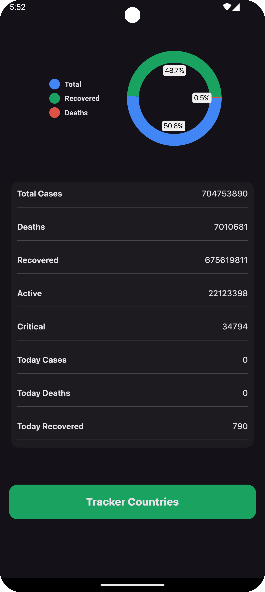
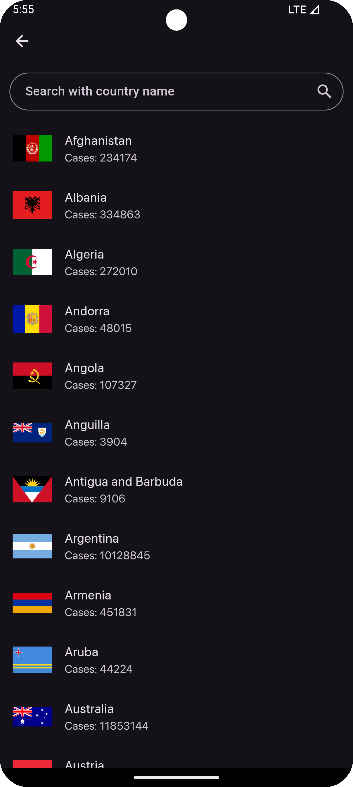
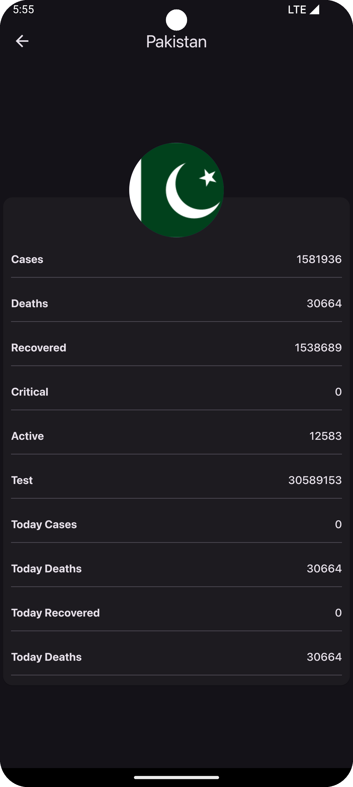

# COVID-19 Tracker App

This Flutter-based COVID-19 tracker app uses a REST API to provide real-time updates on global and country-specific COVID-19 statistics.


## Table of Contents
1. [Features](#features)
2. [Packages Used](#packages-used)
3. [Screenshots](#screenshots)
4. [Installation](#installation)
5. [License](#license)

## Features

- **Splash Screen**: Displays an introduction screen before loading the main app.
- **World COVID Stats**: A screen that shows the global COVID-19 statistics including total cases, recoveries, and deaths.
- **Country List**: This is a screen displaying a list of all countries, allowing users to select one and view its specific stats.
- **Country Stats**: Detailed COVID-19 stats for the selected country.

## Packages Used

- **[http](https://pub.dev/packages/http) ^1.2.2**: For making API requests.
- **[animated_text_kit](https://pub.dev/packages/animated_text_kit) ^4.2.2**: For creating animated text effects.
- **[pie_chart](https://pub.dev/packages/pie_chart) ^5.4.0**: For displaying data as pie charts.
- **[flutter_spinkit](https://pub.dev/packages/flutter_spinkit) ^5.2.1**: For loading indicators.
- **[shimmer](https://pub.dev/packages/shimmer) ^3.0.0**: For creating shimmer effects.

## Screenshots

| World Stats Screen                         | Country List Screen                         | Country Stats Screen                         |
|--------------------------------------------|---------------------------------------------|----------------------------------------------|
|  |  |  |

## Installation

To run this app, follow these steps:

1. Clone the repository:
    ```bash
    git clone https://github.com/Shehryar-dev/covid19-tracker.git
    ```

2. Navigate to the project directory:
    ```bash
    cd covid19-tracker
    ```

3. Install dependencies:
    ```bash
    flutter pub get
    ```

4. Run the app:
    ```bash
    flutter run
    ```

## License

This project is licensed under the MIT License.
